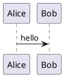

# mdglance

`mdglance` is a small native document previewer for terminal-first workflows.

It opens a Markdown or SVG file in a native window, renders the document read-only, and refreshes when the source file changes. The intended loop is simple: write in a terminal editor, save, and glance at the rendered result without opening a full editor or browser workspace. The app is designed to stay keyboard-first: navigation, search, TOC use, link following, history, presentation slides, and SVG pan/zoom are all available without touching the mouse.

## Status

This is still an early prototype, but it is already usable as a keyboard-first Markdown and SVG viewer for terminal workflows.

[Mermaid](https://mermaid.js.org/) is bundled into the binary at compile time from `assets/mermaid.min.js`, so Mermaid rendering does not require runtime network access. [PlantUML](https://plantuml.com/) blocks are rendered locally through the `plantuml` CLI when it is available. Do not treat this as a hardened renderer for untrusted Markdown yet.

## Usage

Run from the repository:

```sh
cargo run -- path/to/file.md
```

Or pipe a newline-separated file list into the viewer queue:

```sh
fd -e svg | cargo run --
```

Return the shell prompt immediately:

```sh
cargo run -- --detach path/to/file.md
```

Try the included test document:

```sh
cargo run -- examples/render-kitchen-sink.md
```

Build a local debug binary:

```sh
cargo build
./target/debug/mdglance examples/render-kitchen-sink.md
./target/debug/mdglance --detach examples/render-kitchen-sink.md
```

## Features

- Keyboard-first document viewer with no mouse required for core navigation.
- Native window with live reload on file save.
- Configurable keybindings and viewer settings via `mdglance.toml`.
- Table of contents sidebar with keyboard focus mode and section tracking.
- In-viewer navigation for relative `.md` links with back/forward history.
- Optional stdin-driven file queue with previous/next navigation.
- Keyboard link hints for opening visible links quickly.
- Per-document scroll memory while moving between Markdown files.
- Built-in Markdown presentation mode with `presentation: true` frontmatter, `---` slide separators, optional header/footer/page numbering, and viewport-fitted 16:9 slides.
- Native SVG preview mode with fit-to-window, pan, zoom, and reset view.
- Syntax highlighting for fenced code blocks with explicit language tags.
- [Mermaid](https://mermaid.js.org/) diagram rendering without runtime network access.
- Local [PlantUML](https://plantuml.com/) diagram rendering through the `plantuml` CLI, with graceful fallback to code blocks when unavailable or rendering fails.
- Local image support for common raster and SVG formats.

## Keybindings

| Key       | Action                                        |
| --------- | --------------------------------------------- |
| `j` / `k` | Scroll down / up in document mode             |
| `h` / `l` | Back / forward through Markdown history       |
| `[` / `]` | Previous / next file in the viewer queue      |
| `d` / `u` | Half page down / up                           |
| `Space`   | Page down                                     |
| `g` / `G` | Top / bottom                                  |
| `h` / `l` | SVG mode: pan left / right                    |
| `j` / `k` | SVG mode: pan down / up                       |
| `=` / `+` | SVG mode: zoom in                             |
| `-`       | SVG mode: zoom out                            |
| `0`       | SVG mode: reset fitted view                   |
| `/`       | Open search                                   |
| `n` / `N` | Next / previous search hit                    |
| `f`       | Open keyboard link hints                      |
| `p`       | Toggle between Markdown and presentation mode |
| `h` / `k` | Presentation mode: previous slide             |
| `j` / `l` | Presentation mode: next slide                 |
| `t`       | Toggle table of contents                      |
| `Tab`     | Switch focus between document and TOC         |
| `j` / `k` | TOC mode: next / previous heading             |
| `Enter`   | Accept search or jump to selected TOC heading |
| `?`       | Show help                                     |
| `Esc`     | Close search/help                             |
| `q`       | Quit                                          |

## Diagrams

Fenced [Mermaid](https://mermaid.js.org/) blocks are rendered in the preview:

````markdown

````

## Presentations

Presentation files are normal Markdown files with frontmatter at the top:

````markdown
---
presentation: true
presentation_header: mdglance
presentation_footer: Demo deck
presentation_page_numbers: true
---

# Slide One

---

# Slide Two
````

Open the included example:

```sh
cargo run -- examples/render-presentation.md
```

Presentation files open in slide mode by default. Press `p` to toggle between slide mode and normal Markdown mode for the same file.
Slides use a fixed 16:9 stage and scale to the current viewport. Header, footer, and page numbering are optional and configured through frontmatter.

Fenced [PlantUML](https://plantuml.com/) blocks are rendered locally when the `plantuml` CLI is installed:

````markdown

````

## SVG Preview

Open an SVG file directly to preview it with fit-to-window scaling:

```sh
cargo run -- examples/diagram.svg
```

In SVG mode, Markdown-specific features such as TOC, search, and link navigation are disabled. The dedicated SVG controls are pan with `h` `j` `k` `l`, zoom with `=`/`+` and `-`, and reset view with `0`.

## File Queue

When no file argument is provided and stdin is not a TTY, `mdglance` reads newline-separated file paths from stdin, opens the first file, and keeps the rest as a viewer queue:

```sh
fd -e svg | mdglance
```

Use `[` and `]` to move to the previous and next file in that queue. The window title shows the current queue position while you are on a queued file.

## Security Notes

`mdglance` renders Markdown inside a native WebView. That is useful, but it also means Markdown rendering needs a clear security model.

Before previewing untrusted Markdown, the project should harden these areas:

- Strip or escape raw HTML by default.
- Block dangerous link schemes such as `javascript:`.
- Keep vendored [Mermaid](https://mermaid.js.org/) pinned and reviewed.
- Treat local [PlantUML](https://plantuml.com/) execution as part of the trusted local toolchain.
- Keep app IPC minimal and validated.
- Keep external sites out of the preview WebView.

External `http` and `https` links are currently opened in the default browser instead of navigating inside the preview window.

## Development

Format and check:

```sh
cargo fmt
cargo check
```

Build:

```sh
cargo build
```

## License

MIT. See [LICENSE](/Users/wolf/dev/mdview/LICENSE).

## Configuration

`mdglance` resolves config from one of two locations:

1. `./mdglance.toml` in the directory where you invoked the CLI
2. `~/.config/mdglance/config.toml` if no project-local file is present

Defaults stay in the binary, so config is optional.

Example:

```toml
[toc]
visible_on_start = false
max_depth = 3

[window]
width = 1280
height = 900
fullscreen = false

[keybindings]
scroll_down = ["j"]
scroll_up = ["k"]
scroll_left = ["h"]
scroll_right = ["l"]
half_page_down = ["d"]
half_page_up = ["u"]
page_down = ["Space"]
top = ["g"]
bottom = ["Shift+G"]
open_search = ["/"]
accept_search = ["Enter"]
next_search_hit = ["n"]
previous_search_hit = ["Shift+N"]
show_help = ["?"]
close_overlay = ["Escape"]
toggle_toc = ["t"]
toggle_focus = ["Tab"]
toggle_presentation = ["p"]
back = ["h"]
forward = ["l"]
previous_file = ["["]
next_file = ["]"]
open_link_hints = ["f"]
toc_down = ["j"]
toc_up = ["k"]
activate_selection = ["Enter"]
zoom_in = ["=", "Shift+="]
zoom_out = ["-"]
reset_view = ["0"]
quit = ["q"]
```

When you set a keybinding entry, that action's default bindings are replaced by the list you provide.
On macOS, the built-in defaults also include `Cmd+W` and `Cmd+Q`.
