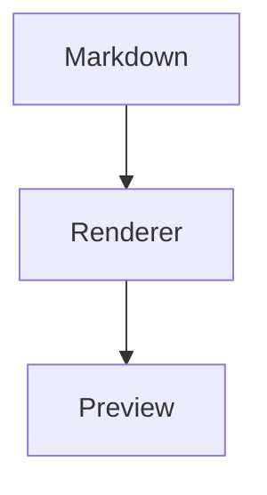
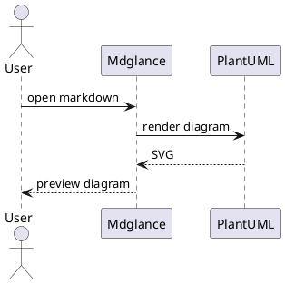
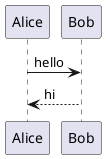

# Diagram Rendering

## Mermaid

```mermaid
flowchart TD
    A[Markdown] --> B[Renderer]
    B --> C[Preview]
```

## PlantUML

```plantuml
@startuml
actor User
participant Mdglance
participant PlantUML

User -> Mdglance: open markdown
Mdglance -> PlantUML: render diagram
PlantUML --> Mdglance: SVG
Mdglance --> User: preview diagram
@enduml
```

## PlantUML Alias

```puml
@startuml
Alice -> Bob: hello
Bob --> Alice: hi
@enduml
```
