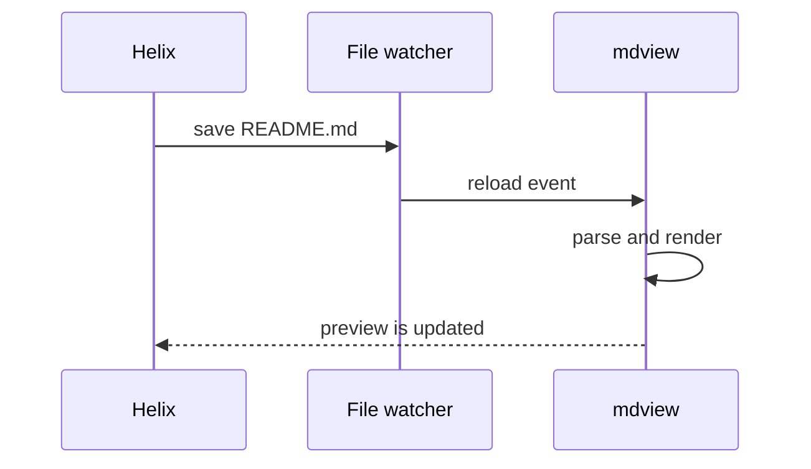
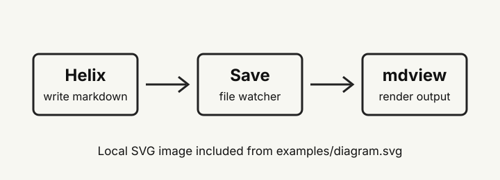

# mdview Rendering Kitchen Sink

This file is meant to exercise the first version of `mdview`. It includes prose, headings, lists, tables, code blocks, inline code, images, blockquotes, task lists, and Mermaid diagrams.

The goal is not to be a Markdown specification test. It is a practical sample you can open while changing the renderer:

```sh
cargo run -- examples/render-kitchen-sink.md
```

## Longer Prose

Markdown preview tools are most useful when they disappear into the writing loop. You edit in the terminal, save the file, and glance at a rendered document without waiting for a full editor or browser-heavy workspace to wake up. This document intentionally uses a few longer paragraphs so line height, text width, and spacing are easier to judge in the native window.

Good preview output should make dense technical notes easy to scan. Headings should create clear breaks, paragraphs should not stretch too wide, and code should stand apart without dominating the page. Mermaid diagrams should render inline with the surrounding content and should not require the source Markdown to live inside a project, workspace, or vault.

Another useful behavior is stable refresh. When the source file changes, the preview should update without throwing away the reader's place in the document. This sample has enough vertical length to make scroll preservation noticeable during manual testing.

## Unordered Lists

- Write Markdown in Helix.
- Save the file with `:write`.
- Let `mdview` notice the change.
- Check the rendered output in a native window.
- Keep the loop fast enough that previewing feels disposable.

Nested unordered lists:

- Rendering concerns
  - headings
  - paragraphs
  - code blocks
  - diagrams
- App concerns
  - launch speed
  - file watching
  - scroll preservation
  - local asset loading

## Ordered Lists

1. Parse command-line arguments.
2. Resolve the input path.
3. Render Markdown to HTML.
4. Open a native WebView.
5. Watch the file for changes.
6. Re-render after each save.

Nested ordered lists:

1. Build the first usable version.
   1. Keep styling simple.
   2. Keep rendering predictable.
   3. Keep the binary easy to run.
2. Improve the rendering path.
   1. Vendor Mermaid for offline use.
   2. Add syntax highlighting.
   3. Improve link handling.

## Task Lists

- [x] Open arbitrary Markdown files.
- [x] Render fenced Mermaid blocks.
- [x] Refresh when the file changes.
- [ ] Vendor Mermaid locally.
- [ ] Add syntax highlighting.
- [ ] Add a release build/install command.

## Inline Code

Inline code should sit comfortably inside prose. For example, the app currently accepts a single `file` argument, uses `pulldown-cmark` for Markdown parsing, and calls `evaluate_script` to update the WebView after a save.

Small command names like `hx`, `cargo`, `git`, `rg`, and `mdview` should not disturb line height.

## Code Blocks

Rust:

```rust
use std::path::PathBuf;

fn preview_target(file: PathBuf) -> String {
    format!("Previewing {}", file.display())
}
```

Shell:

```sh
cargo build
cargo run -- examples/render-kitchen-sink.md
```

TOML:

```toml
[package]
name = "mdview"
version = "0.1.0"
edition = "2024"
```

JSON:

```json
{
  "viewer": "mdview",
  "mode": "read-only",
  "refresh": "on-save"
}
```

## Mermaid




## Images

The image below is a local SVG referenced with a relative path. This checks that the viewer's document base URL allows local assets next to the Markdown file to load correctly.



The next image is a local JPG in the same folder. It checks raster image loading and scaling.


Remote images are regular Markdown too, but this test file avoids them so it stays deterministic.

## Tables

| Area | Current behavior | Notes |
| --- | --- | --- |
| Markdown | Rendered locally | Uses `pulldown-cmark` |
| Mermaid | Rendered in WebView | Currently loaded from CDN |
| Images | Relative paths work | Uses a document `<base>` URL |
| Refresh | On file changes | Watches the parent directory |

## Links

This external link is included to test navigation from rendered Markdown:

[TUM Chair of Computational Civil Engineering](https://www.cee.ed.tum.de/ccbe/home/)

## Blockquote

> A previewer should be quick enough that using it does not feel like switching tools.
> It should stay out of the editing path and make the rendered result easy to inspect.

## Mixed Content

Here is a small checklist inside prose:

- Keep source files readable.
- Keep preview output calm.
- Prefer predictable behavior over feature sprawl.

And here is a final longer paragraph to test the bottom of the page. If you edit this file while `mdview` is open, the rendered window should refresh after save and keep roughly the same scroll position. That makes it practical to work on a section halfway through a long technical document without snapping back to the top every time.
